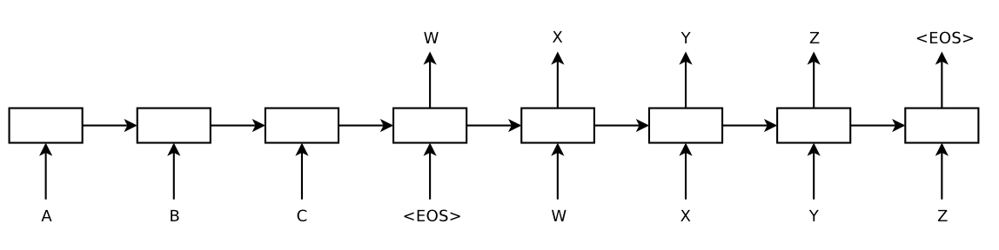
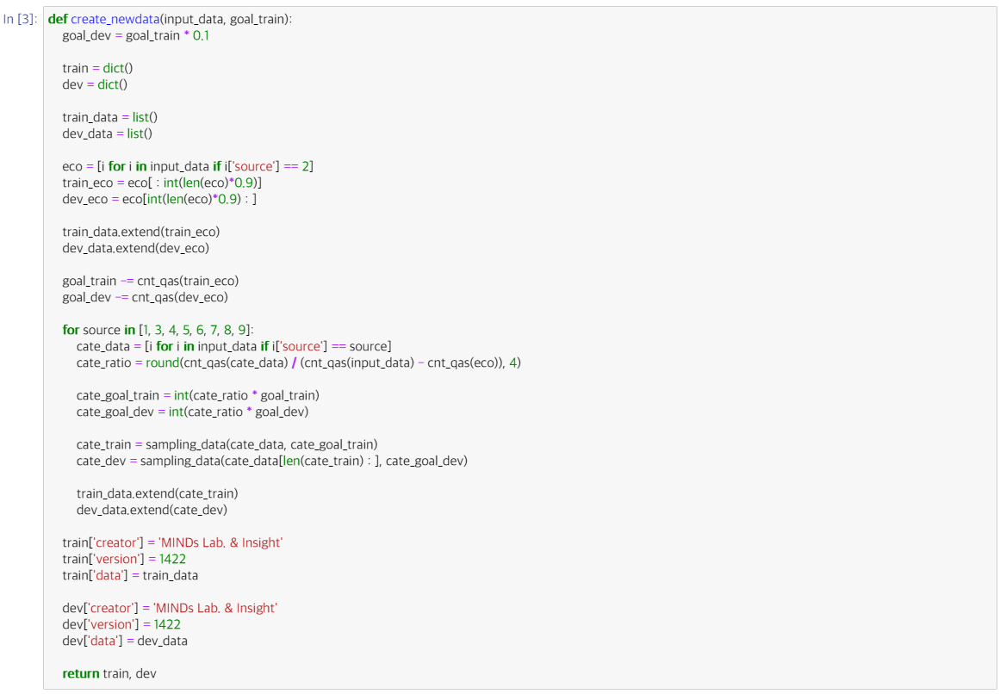
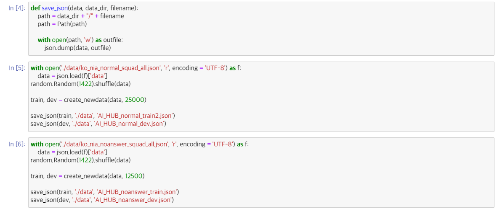
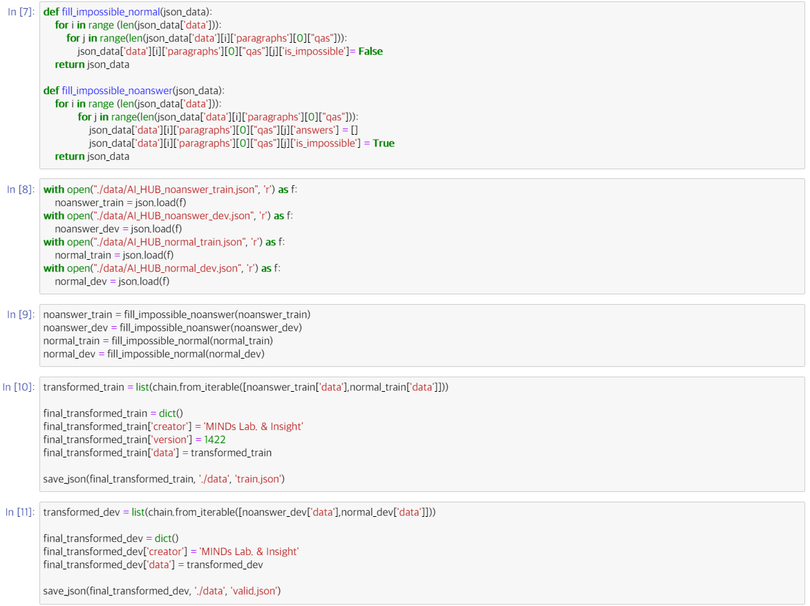

# NLP

## 1. 서론

### 1.1. Transformer란?

### Seq2Seq(RNN)



- Context vector(문맥 벡터)가 고정된 크기를 가짐.
  - 소스 문장의 정보를 항상 고정된 크기로 갖는 것은 병목현상의 원인이 될 수 있음.
  - 문장의 길이가 길어질수록 하나의 context vector가 모든 정보를 함축하는 것이 어려워짐.

---

### Attention Mechanism

- 디코더에서 출력 단어를 예측하는 매 시점마다, 인코더에서의 전체 입력 문장을 다시 한 번 참고함.
- 해당 시점에서 예측해야할 단어와 연관이 있는 입력 단어 부분을 좀 더 집중(attention)함.

---

### Transformer

- RNN이나 CNN을 사용하지 않고 attention mechanism만을 사용하는 모델
- 기존 인코더, 디코더의 컨셉은 그대로 가지고 있음.
- RNN을 사용하지 않기 때문에 Parallelization이 가능하여 학습의 속도가 빠르고 성능이 향상됨.
- Positional Encoding이라는 단어의 위치 정보를 사용함.


---

### 1.2. BERT란?

### Before BERT

- Encoder: 입력값을 양방향으로 처리함.
- Decoder: 입력값을 왼쪽에서 오른쪽으로 단방향 처리함.
  - 단어를 하나씩 읽어가면서 다음 단어를 예측하는 방식(왼→오)

---

### Bidrectional Encoder Representations from Transformers

: Transformer의 양방향 인코더를 사용한 사전학습 모델

→ 양방향으로 문맥을 이해할 수 있음.


- 기존 LM(Language Model)은 현재까지 읽은 단어를 통해서 다음 단어를 예측하도록 학습됨.
- 반면에 BERT는 동일한 문장을 그대로 학습하되, 가려진 단어(masked token)를 예측하도록 학습됨.

---

### Overall Procedures


- BERT는 Pre-training과 Fine-tuning 단계로 나뉘어짐.
- Pre-training
  1. Masked Language Model(MLM)
     - [Mask] 토큰을 예측하는 사전학습을 진행함.
     - 해당 토큰을 맞추어 내는 task를 통해 문맥을 파악하는 능력을 기르게 됨. (Bidirectional)
  2. Next Sentence Prediction(NSP)
     - 두 문장 사이의 관계를 이해하기 위해 학습함.
- Fine-tuning
  1. Sentence Pair Classification
  2. Single Sentence Classification
  3. Question Answering
  4. Single Sentence Tagging
- 다양한 사전학습 모델(PLM, Pre-trained Language Model) 존재

사전학습을 통해 언어를 이해한 후, fine-tuning을 통해 특정 자연어 처리 문제에 적용하는 것

---

## 2. 본론

### 2.1. 주제 선정

### BERT 활용 분야

1. Single Sentence Classification(문장 한 개 분류)

   

- 문장 라벨 예측
- 스팸 찾기, 문서 카테고리 분류, 감성 분류 등

2. Sentence Pair Classification (문장 두 개 관계 분류)


- 문장 두 개간 관계 분석
- 의역, 같은 종류 문장끼리 분류 등

3. Single Sentence Tagging (문장 내 단어 라벨링)


- 한 문장 내 단어 레이블 예측
- 개체명 인식, 품사 태깅 등

4. Question Answering (묻고 답하기)


- 입력값으로 [질문, 정답 포함된 단락]을 [SEP] 토큰(문장 구분 토큰)으로 구분하여 줌.
- 출력값의 마지막 토큰들이 단락 속에 포함된 정답의 시작 인덱스와 마지막 인덱스를 출력하도록 학습시킴.

이 중 팀원 당 2~3개씩 활용 방안을 제시

⇒ 투표를 통해 **QA(질의응답) 활용**으로 결정!

---

### 그렇다면, 어떤 내용에 대답할 수 있는 QA 모델을 만들까?


최근 주식에 대한 관심이 늘어나면서 주식 투자를 위해 기업에 대한 정보를 찾는 사람들이 많아짐

⇒ **기업 정보에 관한 질문에 대답해주는 서비스**

있다면 활용하기에 좋을 것이라 예상

따라서 모델이 참고할 수 있는 기업 정보를 담은 도메인 필요

⇒ 국내외 증권사 애널리스트들의 기업분석 리포트를 제공하는 **한경 컨센서스**로 결정


---

### KoBERT vs KBALBERT

- 기업 정보 QA 모델을 위해서 어떤 Pre-trained BERT 모델을 사용하면 좋을까?

[KoBERT와 KBALBERT 비교](https://www.notion.so/3afe0fb8dccb4880912e21e850b7e1f0)

따라서 주식 투자를 위한 기업 정보 질문에 대답하는 QA 모델을 위해서는

KoBERT<**KBALBERT**가 적합하다고 판단

⇒ 모델 요청

---

### 2.2. 데이터 크롤링 [한경 컨센서스]

질의응답 예시)


- 질문을 받았을 때, BERT모델이 질문에 대한 대답을 찾을 데이터(context)가 필요

  ⇒ 한경 컨센서스 내의 종목 리포트를 크롤링 후 DB화 하여 context로 활용!

- 2020.11.26~2021.05.26 총 6개월 간 등록된 기업리포트 크롤링 후 DB화

```python
sdate = '2020-11-26'
edate = '2021-05-26'
page_start = 1
page_end = 34

# 크롤링 실행
HK_crawler(sdate, edate, page_start, page_end)
```

- DB 내용


- 이후 필요시 크롤링해서 추가로 DB 업데이트

---

### 2.3. Fine-Tuning

### KB-ALBERT Fine-Tuning 진행 과정

- KB-ALBERT는 Pretrain이 완료된 모델이므로 QA 모델의 목적에 맞게 **Fine-Tuning을 진행**해야 함


- 질문과 지문을 Input으로 받고,
- 지문 속에서 질문에 대한 답변을 찾아 Output으로 내보내게 됨

  **→ 질문, 지문, 답변이 필요**


- 질문과 지문을 토큰화한 후, [CLS] + 질문 + [SEP] + 문맥 + [SEP]의 형태로 이어 붙임

---

- **KorQuAD 2.0** 데이터셋을 사용하려고 계획 → **데이터 형식이 다르기 때문에 불가능**

다른 데이터셋을 활용해, 이를 **KorQuAD 양식**으로 가공하자!

- **AI Hub MRC Dataset**


**→ 본문에서 답을 찾을 수 없는 질문에 대한 학습도 이루어졌다는 것이 특징**

**답이 없는 질문**에 대해 오류가 아닌 **처리가 가능**하게 함 **(중요)**


     AI Hub 기계독해 데이터셋의 구성 비율: **경제 관련 본문은 모두 사용하고, 나머지는 각자의 비율에 맞게 사용**

---

### **Dataset Sampling**



1️⃣ **과정**

- **dev 목표 개수를 train 목표 개수의 10%로 설정** (2)
- 전체 AI Hub 데이터 중 경제 데이터 train : dev = 9:1로 **비율 관계 없이** **전부 사용** (10)
- 목표 개수에서 경제데이터 개수 빼서 목표까지 **남은 개수 구하기** (17)
- 경제 제외 **각 카테고리별로 비율 분배해서 넣기** (20)
- 비율은 AI Hub 경제 제외 데이터 중에서 해당 카테고리가 차지하는 비율 (cate_ratio) (20)
- 각 카테고리별 목표 개수 설정 (24)
- 설정한 목표 개수만큼 데이터 샘플링 (27)
- 최종 딕셔너리 구성 (33)

---



2️⃣ **AI Hub 데이터 불러와서 랜덤하게 답이 있는 25,000개, 답이 없는 12,500개 추출하기 (RAM)**

---



3️⃣ **KorQuAD 2.0 형식과 같이 is_impossible을 넣어 주고**[9]**, noanswer + answer 합치기**

⇒ **최종 train/valid json 만드는 과정 [11]**

---

### 2.4. 서비스 알고리즘

### DB 구조


---

### FlowChart


---

### 세부 사항

1️⃣ **사용자 입력**
서비스 사용자로부터 아래 두 가지 항목에 대해 입력 받음

1. 종목명 (ex. 삼성전자)
2. 질문 (ex. 삼성전자의 목표주가는 얼마인가요?)

2️⃣ **유효성 체크**
사용자가 입력한 항목에 대해,

1. 두 항목 모두 입력되었는지 체크
2. 입력한 종목명이 company DB 내에 존재하는지 체크
   존재하지 않는다면? ⇒ 종목명 재입력 필요

---

3️⃣ **리포트 최신 여부 확인 및 크롤링**


4️⃣ **최신 리포트 원문 추출**
report DB 내 해당 종목의 가장 최신 리포트 원문(context)을 추출함

5️⃣ **QA MODEL**

1. report DB에서 받아온 **원문(context)**와 **질문**을 input으로 함
2. 입력값들을 tokenize (token이 512개가 넘을시(원문+질문) **chunkify** 진행)

   - **Chunkify?**
     Break up a long article into chunks that fit within the max token requirement for that Transformer model
   - QA에서 각 chunk는 다음과 같은 포맷을 따라야한다.(BERT/ALBERT 등)

     [CLS] question tokens [SEP] context tokens [SEP]

     

3. tokenize된 값들을 모델에 넣어 결과를 얻는다.

6️⃣ **결과**

- 결과는 각 Chunk별로 도출되며, 가장 먼저 나온 answer를 최종결과로 출력하게 됨.
- 만약, Chunk안에 answer값이 없다고 판단되면 [CLS] 반환 → 결과 처리할 때 무시

7️⃣ **추가 질문 여부 확인**

```markdown
**if(yes):**
1️⃣**사용자 입력**으로 이동
else:
종료
```

8️⃣ **프로그램 종료**

---

## 3. 결론

### 3.1. Let's 금융어!


---

### 3.2. 시사점 및 의의

1. NLP를 활용한 하나의 완성된 서비스를 제작
2. 경제 도메인 외 다른 도메인 데이터에 대해서도 서비스 구현 가능
   - 해당 도메인 특화 PLM 사전학습

---

### 3.3. 한계점

1. 컴퓨터 리소스의 한계로 확보한 데이터를 모두 활용하지 못함.
2. 테이블 데이터를 처리하지 못함.
3. 테이블 데이터를 포함한 PDF 데이터가 raw하게 사용되어, 깔끔한 답변을 얻기 어려운 경우 존재함.

→ 컴퓨터 리소스 업그레이드 및 데이터 전처리를 통해 해결 가능

---
